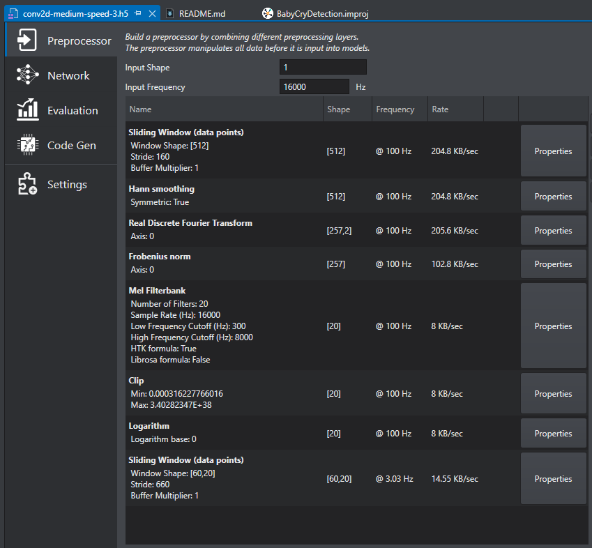
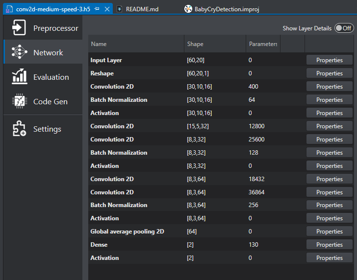

[Click here](../README.md) to view the README.

## Design and implementation

The design of this application is minimalistic to get started with code examples on PSOC&trade; Edge MCU devices. All PSOC&trade; Edge E84 MCU applications have a dual-CPU three-project structure to develop code for the CM33 and CM55 cores. The CM33 core has two separate projects for the secure processing environment (SPE) and non-secure processing environment (NSPE). A project folder consists of various subfolders, each denoting a specific aspect of the project. The three project folders are as follows:

**Table 1. Application projects**

Project | Description
--------|------------------------
*proj_cm33_s* | Project for CM33 secure processing environment (SPE)
*proj_cm33_ns* | Project for CM33 non-secure processing environment (NSPE)
*proj_cm55* | CM55 project

 

### Baby cry detection

This example includes the baby cry detection model that works out-of-box without requiring any changes.

The baby cry detection model processes the audio data from the pulse-density modulation (PDM) microphone to detect whether a baby is crying or not based on the "Baby Cry Detection" starter project in the DEEPCRAFT&trade; Studio.

DEEPCRAFT&trade; Studio generates the *model.c/h* file that contains the code required for processing the data before being fed to the ML model and the code needed for model inferencing. 

The input data is raw audio in the PCM format. The data from the PDM microphone is converted to PCM using the built-in PDM/PCM converter block. The received PCM data has a 16 kHz sampling rate and it is fed into the audio processing code generated by DEEPCRAFT&trade; Studio using the `IMAI_enqueue` API after 1024 samples are received. After the processing is done, the `IMAI_dequeue` API returns the results in the form of scores corresponding to each of the labels. All the label scores along with the label corresponding to the maximum score beyond a threshold is printed on the UART terminal.

The preprocessing layers for the baby cry detection application is shown in **Figure 1**.

**Figure 1. Baby cry detection pre-processing layers**

The baby cry detection model is a 2D convolutional neural net that contains the layers, as shown in **Figure 2**.

**Figure 2. Baby cry detection model layers**

### Memory placement of model and arena data

On CM33 + NNLite, it is recommended to place the model weights and arena data in the SRAM for best performance. Place the model weights by defining the `CY_ML_MODEL_MEM` macro to the desired memory section from the CM33 NS linker script. For the arena data, use the `CY_ML_ARENA_MEM` macro. 

In this code example, the `CY_ML_MODEL_MEM` macro is set to the `.cy_sram_code` section using the CM33 project *Makefile*, ensuring the model data is placed in SRAM for optimal performance. The `CY_ML_ARENA_MEM` macro is not defined in this example so the arena buffer gets placed in the default data segment. 

> **Note:** The memory section to which the macros are assigned must be defined in the CM33 NS linker script.

On CM55 + U55, it is recommended to place the model weights in the system SRAM (SoCMEM) for best performance while the arena data must be placed in the system SRAM (SoCMEM) for the proper functioning of the application. Configure the model data placement using the `CY_ML_MODEL_MEM` macro and the arena data using the `CY_ML_ARENA_MEM` macro. 

In this code example, both `CY_ML_MODEL_MEM` and `CY_ML_ARENA_MEM` macros are set to the `.cy_socmem_data` section using the CM55 project Makefile, ensuring the model and arena data are placed in the System SRAM (SoCMEM) for optimal performance. 

> **Note:** The memory section to which the macros are assigned must be defined in the CM55 linker script.

### Generating the model

This code example ships with the baby cry detection files (*model.c/h*) produced by DEEPCRAFT&trade; Studio. Use DEEPCRAFT&trade; Studio to capture the new data and review, modify, or generate new models for evaluation. For more information, see [Deploy model on PSOC&trade; 6 and PSOC&trade; Edge boards](https://developer.imagimob.com/deepcraft-studio/deployment/deploy-models-supported-boards/deploy-model-PSOC-6-PSOC-Edge). For details on generating, optimizing, and validating the model code using DEEPCRAFT&trade; Studio, see [Code generation for Infineon boards](https://developer.imagimob.com/deepcraft-studio/code-generation/code-gen-infineon-boards).

### Running the generated model

1. Generate the model files as described in [Generating the model](#generating-the-model).

2. Open the *common.mk* file and set `ML_DEEPCRAFT_CPU` to 'cm55' or 'cm33'.

3. Open the *proj_cmxx/Makefile* file and set `NN_TYPE` to 'int8x8' or 'float' to select the desired quantization based on the generated model.

4. Program the device as described in the [Operation](../README.md#operation) Section.

 